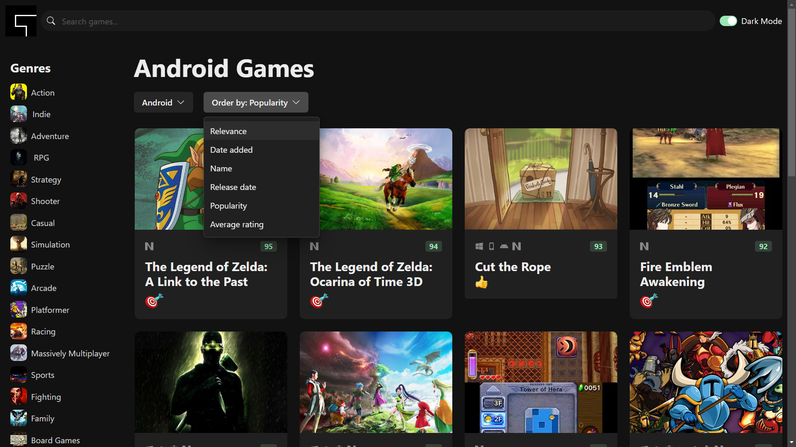
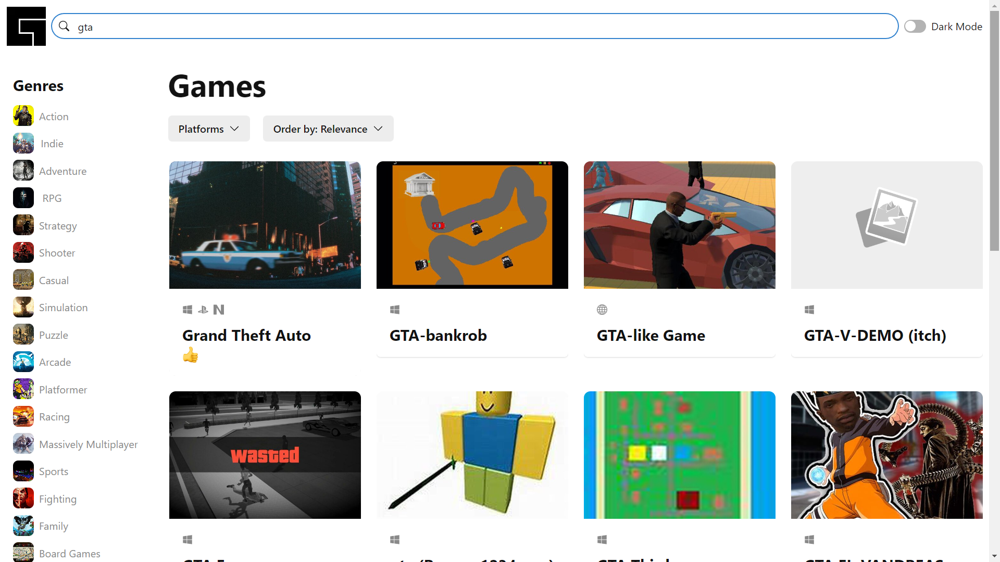
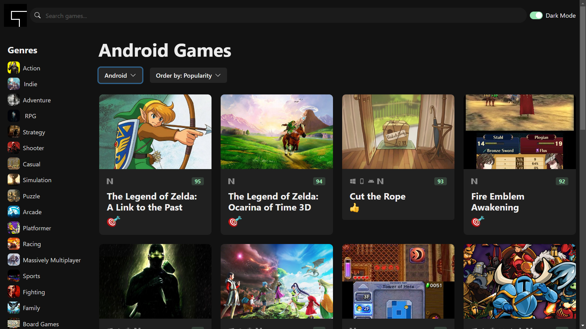
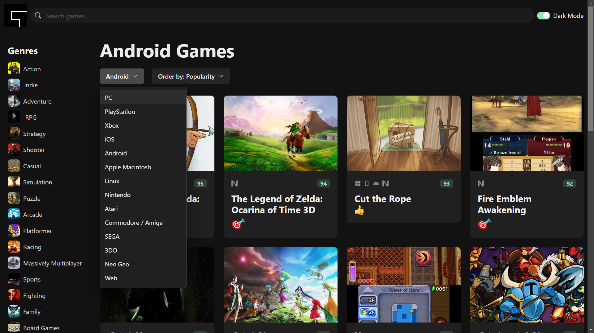
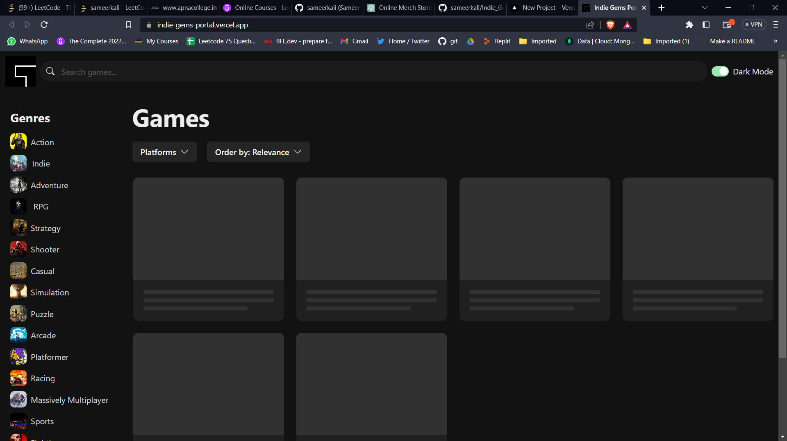
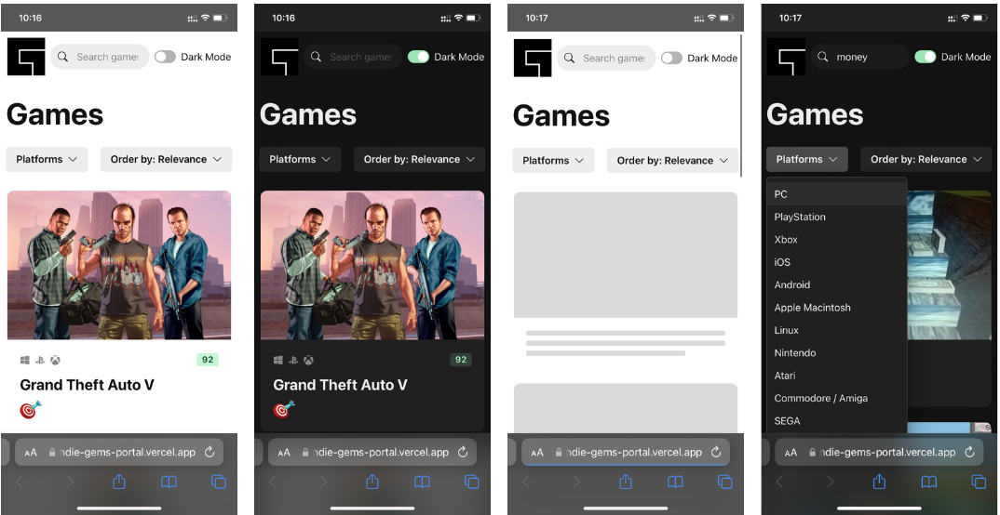

# Games Portal

# Screenshots

## category searching

## light theme

## main look

## platform searching

## skeliton_loading

# Responsive Design

Welcome to Games Portal, a platform where you can search and discover your favorite games based on various categories.

## Introduction

Games Portal is a web application that allows users to search for games based on genres, platforms, release dates, and ratings. It provides a convenient way to explore and find games that match your preferences.

## Features

- Search for games by genre, platform, release date, and rating.
- Sort search results by popularity, release date, or rating.
- User-friendly interface for easy navigation.

## Technologys
* react18
* typescript
* chackra-ui
* https://rawg.io/ `for game DB api`
* vite
---

